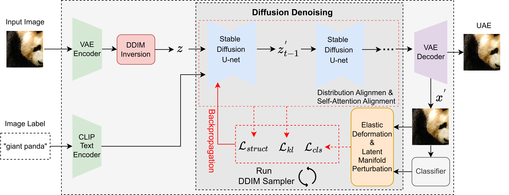
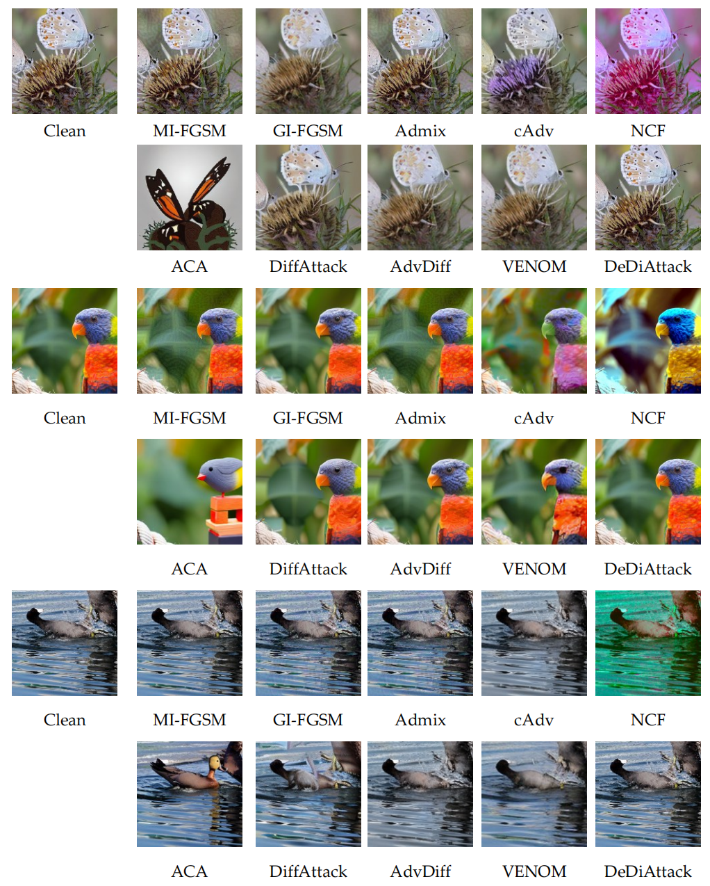

## DeDiAttack
 
   The key code repository for our paper: **DeDiAttack: Enhancing Transferability of Unrestricted Adversarial Examples via Deformation-Constrained Diffusion.**

## Overview

<div>
  
</div>

## Visualization

<div>
  
</div>

## Requirements

1. Hardware Requirements
    - GPU: 1x high-end NVIDIA GPU with at least 16GB memory
    - Memory: At least 40GB of storage memory

2. Software Requirements
    - Python >= 3.10
    - CUDA >= 12.2

   To install other necessary requirements:
   ```bash
   pip install diffusers transformers natsort
   ```
   *(Note: other dependencies like PyTorch, torchvision, tqdm, scipy, and timm are also required).*

3. Datasets
   - Please download the dataset [ImageNet-Compatible](https://github.com/cleverhans-lab/cleverhans/tree/master/cleverhans_v3.1.0/examples/nips17_adversarial_competition/dataset) and then change the settings of `--images_root` and `--label_path` in `main.py`.

4. Stable Diffusion Model
   - We adopt [Stable Diffusion 2.1 Base](https://huggingface.co/stabilityai/stable-diffusion-2-1-base) as our foundational diffusion model. You can specify the pretrained weight path via `--pretrained_diffusion_path` in `main.py`.
   - **Note**: The official `stabilityai/stable-diffusion-2-1-base` repository on Hugging Face has been made private. You can download the weights from ModelScope instead: [https://www.modelscope.cn/models/stabilityai/stable-diffusion-2-1-base](https://www.modelscope.cn/models/stabilityai/stable-diffusion-2-1-base).

## Crafting Unrestricted Adversarial Examples 

   To craft unrestricted adversarial examples utilizing DeDiAttack, run this command:
   
   ```bash
   python main.py --model_name <surrogate_model> \
                  --save_dir <save_path> \
                  --images_root <clean_images_path> \
                  --label_path <clean_images_label.txt> \
                  --diffusion_steps 20 \
                  --start_step 15 \
                  --iterations 30
   ```
   
   **Distribution Alignment&Structure Preservation**:
   You can also tune the specific hyperparameters directly via command line arguments:
   ```bash
   --decowa_num_warping 5 \
   --kl_prior_loss_weight 100 \
   --self_attn_loss_weight 100 \
   --attack_loss_weight 10
   ```
   
   The specific surrogate models we support can be found in the default list inside `other_attacks.py` (e.g., `resnet50`, `vgg19`, `vit_base_patch16_224`, etc.).

## Evaluation
   
   By default, you can trigger the robust evaluation against black-box models simply by appending the `--is_test True` flag when running `main.py`. It will test the generated adversarial images present in the save directory.
   
   ```bash
   python main.py --is_test True --images_root <path_to_adv_images>
   ```